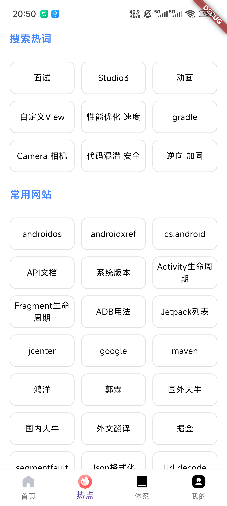
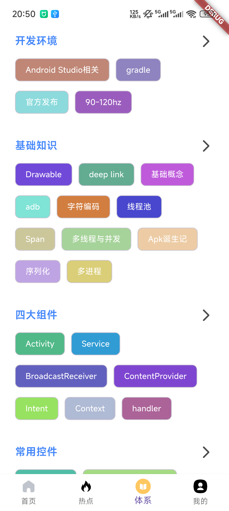
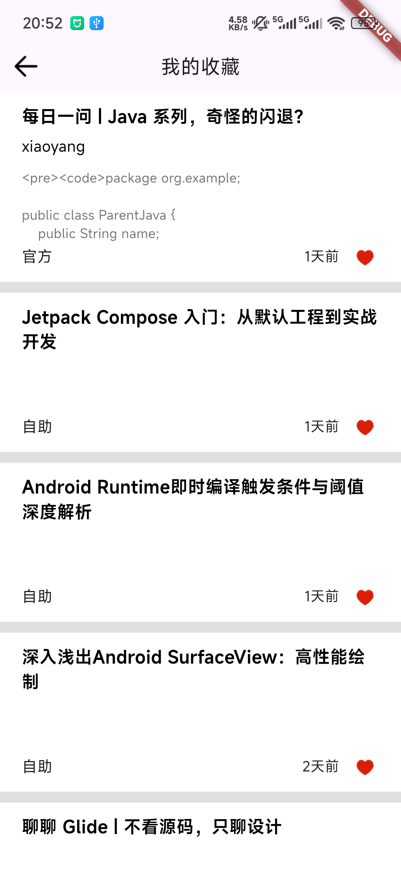
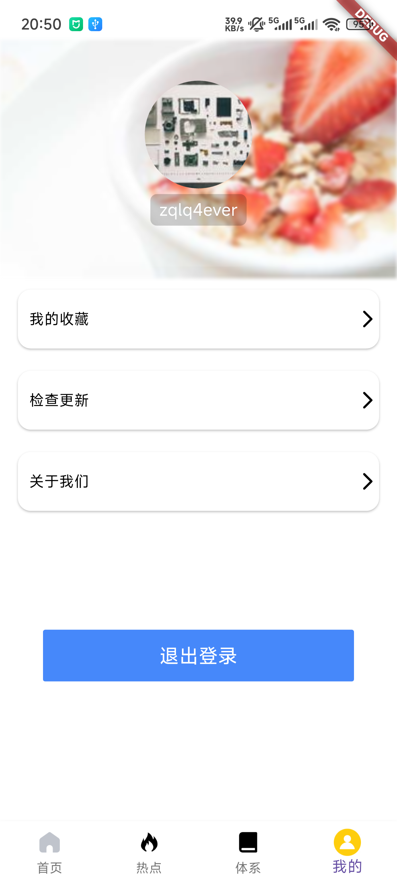
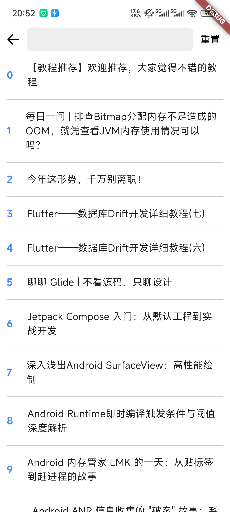

# wan_flutter

wanandroid flutter 版本 。
项目用于学习 flutter 基本用法，目前借鉴了其它开源项目写法，处于模仿阶段。
主要用了 Dio、Provider、GetX、card_swiper、pull_to_refresh_flutter3等插件，项目模式属于 MVVM，仿照 Android 开发的思路 。
目前还处于功能完善阶段，偶尔会添加新功能，也会时不时重构现有的代码。

下载 Android Demo 体验 : https://www.pgyer.com/ER0YOhzL

效果预览图 : 

|        |  |  |
|---------------------------------|-----------------------------|--------------------------------|
|  |    |     |
| ---                             | ---                         | ---                            |
